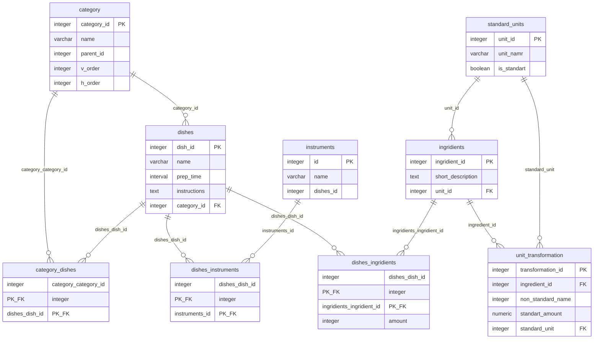

```mermaid
erDiagram
    category ||--o{ category_dishes : "category_category_id"
    dishes ||--o{ category_dishes : "dishes_dish_id"
    category ||--o{ dishes : "category_id"
    dishes ||--o{ dishes_instruments : "dishes_dish_id"
    instruments ||--o{ dishes_instruments : "instruments_id"
    dishes ||--o{ dishes_ingridients : "dishes_dish_id"
    ingridients ||--o{ dishes_ingridients : "ingridients_ingridient_id"
    standard_units ||--o{ ingridients : "unit_id"
    ingridients ||--o{ unit_transformation : "ingredient_id"
    standard_units ||--o{ unit_transformation : "standard_unit"

    category {
        integer category_id PK
        varchar name
        integer parent_id
        integer v_order
        integer h_order
    }

    dishes {
        integer dish_id PK
        varchar name
        interval prep_time
        text instructions
        integer category_id FK
    }

    category_dishes {
        integer category_category_id PK_FK
        integer dishes_dish_id PK_FK
    }

    instruments {
        integer id PK
        varchar name
        integer dishes_id
    }

    dishes_instruments {
        integer dishes_dish_id PK_FK
        integer instruments_id PK_FK
    }

    ingridients {
        integer ingridient_id PK
        text short_description
        integer unit_id FK
    }

    dishes_ingridients {
        integer dishes_dish_id PK_FK
        integer ingridients_ingridient_id PK_FK
        integer amount
    }

    standard_units {
        integer unit_id PK
        varchar unit_namr
        boolean is_standart
    }

    unit_transformation {
        integer transformation_id PK
        integer ingredient_id FK
        integer non_standard_name
        numeric standart_amount
        integer standard_unit FK
    }
```
